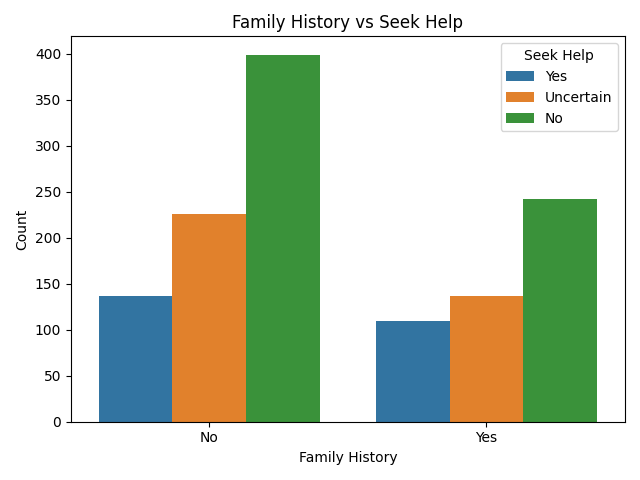
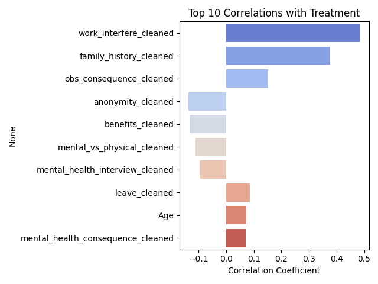

# 🧠 Predicting Mental Health In Tech Using Survey

This project explores the 2016 OSMI Mental Health in Tech Survey, a dataset that captures how employees in the technology sector perceive and respond to mental health challenges in the workplace. The goal of this project is twofold:  

1. Exploratory Data Analysis (EDA):  
    - Understand demographic and workplace factors that influence mental health.  
    - Visualize patterns across age, gender, company size, geography, and workplace policies.  
  
2. Predictive Modeling:  
    Build machine learning models to predict whether an individual is likely to:
   - Seek help if they face mental health challenges.
   - Proceed with treatment after seeking help.

    Compare the influence of workplace support, personal history, and company culture on awareness versus action.  
  
By combining EDA with predictive modeling, this project aims to provide insights into how workplace policies and cultural attitudes impact mental health outcomes.  

## 📚 Table of Contents  
1. [Dataset Description](https://github.com/Ashutosh-Dubal/Predicting-Mental-Health-Risk-Using-Lifestyle-Survey-Data?tab=readme-ov-file#-dataset-description)  
2. [Challenges & Learnings](https://github.com/Ashutosh-Dubal/Predicting-Mental-Health-Risk-Using-Lifestyle-Survey-Data?tab=readme-ov-file#-challenges--learnings)
4. [Key Insights & Analysis](https://github.com/Ashutosh-Dubal/Predicting-Mental-Health-Risk-Using-Lifestyle-Survey-Data?tab=readme-ov-file#-key-insights--analysis) 
5. [Prediction & Evaluation]()
6. [Model Interpretation]()
7. [Tech Stack](https://github.com/Ashutosh-Dubal/Predicting-Mental-Health-Risk-Using-Lifestyle-Survey-Data?tab=readme-ov-file#-tech-stack)  
8. [Project Structure](https://github.com/Ashutosh-Dubal/Predicting-Mental-Health-Risk-Using-Lifestyle-Survey-Data?tab=readme-ov-file#-project-structure)  
9. [Author](https://github.com/Ashutosh-Dubal/Predicting-Mental-Health-Risk-Using-Lifestyle-Survey-Data?tab=readme-ov-file#%E2%80%8D-author)  
10. [License](https://github.com/Ashutosh-Dubal/Predicting-Mental-Health-Risk-Using-Lifestyle-Survey-Data?tab=readme-ov-file#-license)  

---

## 📦 Dataset Description

The dataset comes from the OSMI Mental Health in Tech Survey (2016), which collected responses from employees in the technology sector about their experiences with mental health.

- Rows (responses): 1,251  
- Columns (features): 27 survey questions + derived cleaned features  
- Key features include:
        
  - Demographics: Age, Gender, Country, State (US only)
  - Workplace Factors: company size, remote work, leave policies, benefits, wellness programs, anonymity
  - Personal/Social Factors: family history of mental illness, supervisor and coworker support
  - Target:
    - seek_help: whether the respondent knows about options/resources for help  
    - treatment: whether the respondent has sought any treatment for their mental health condition

---

## 🧠 Challenges & Learnings

Working through this project helped me bridge the gap between data exploration and applied machine learning. Some of the most valuable lessons came from debugging and understanding why things broke.

- Handling categorical data:
  This was my first experience performing EDA and predictive modeling on a dataset that was mostly categorical. Encoding and preprocessing the data (especially using ColumnTransformer and OneHotEncoder) taught me a lot about how models interpret categorical features.

- Feature alignment issues:
I ran into mismatches between X.columns from model_training.py and the encoded feature names from feature_importance.py.
Fixing this required tracing how the preprocessor renamed and expanded categorical columns — a deep but rewarding dive into scikit-learn pipelines.

- Naive Bayes limitations:
While Naive Bayes handled categorical inputs quickly, trying to visualize its feature probabilities turned out messy and not very interpretable.
I learned that not every model needs visualization — sometimes interpretability comes from selecting the right algorithm, not over-analyzing all of them.

- Feature naming clarity:
Decoding names like cat__benefits_cleaned_1 into readable labels (e.g., Benefits = Yes) was a subtle but important step for human-centered interpretation.
It reminded me how important clean naming conventions are when communicating model insights to non-technical readers.

- Visualization for understanding:
Building correlation heatmaps and feature importance charts helped connect intuition with results. Visuals became a powerful tool to verify if model findings matched domain logic.

Overall, this project reinforced that building a predictive model isn’t just about achieving accuracy — it’s about understanding why the model behaves the way it does.

---

## 👁 Key Insights & Analysis

The survey reveals how workplace environment, personal history, and demographics interact to shape whether individuals seek help or pursue treatment for mental health concerns.
	
1. Family history leaves a strong imprint

| Treatment (Family History) | Seek Help (Family History) | 
|----------------------------|----------------------------|
|  | |

Family history shows one of the strongest relationships in the dataset. Respondents with a family history of mental health conditions are significantly more likely to receive treatment, as shown by the larger “Yes” portion in the stacked bar chart. However, when looking at willingness to seek help, the difference is less pronounced. The count plot shows that both groups include a large number of “No” and “Uncertain” responses, suggesting that family history alone does not strongly influence whether individuals say they would seek help. Together, these charts highlight an important distinction: personal background increases the likelihood of treatment, but does not necessarily prompt earlier help-seeking.
	
2. Workplace culture matters
    
| Treatment (coworker support) | Seek Help (coworker support) | 
|----------------------------|----------------------------|
|  |  |

For treatment, coworker support does not show a strong trend — the proportion receiving treatment stays fairly similar across all levels of coworker support. For seek help, however, we see a clearer pattern: the share of “Yes” responses gradually increases as coworkers are perceived as more supportive, with some movement away from “No” and “Uncertain.” This suggests coworkers mainly influence whether people feel comfortable raising their hand, rather than whether they ultimately receive treatment.

| Treatment (supervisor support) | Seek Help (Supervisor support) | 
|----------------------------|----------------------------|
|  |  |

Supervisor support shows a stronger impact, especially on treatment. When employees perceive their supervisor as supportive, the proportion receiving treatment increases from about one-third to nearly three-quarters in the stacked bar chart. For seek help, supportive supervisors are also associated with a higher share of “Yes” and fewer outright “No” responses.

Together, these charts highlight that workplace support — particularly from supervisors — plays an important role in encouraging employees to act on mental health concerns, even though structural factors still shape who ultimately accesses professional care. 

3. Self-employment shows hidden risks

| Treatment | Seek Help | 
|----------------------------|----------------------------|
|  |  |

Self-employment does not appear to have a strong influence on either treatment or help-seeking. The proportions remain fairly similar across all groups, with only small shifts in the “Yes” responses. This suggests that access and willingness to seek help are shaped more by workplace culture and structural factors than employment type alone.

| Treatment | Seek Help | 
|----------------------------|----------------------------|
|  |  |

The above correlation graphs further support the idea that self-employment has a higher impact on weather treatment is pursued than the willingness to seek help.

4. Company size creates opportunity gaps

| Treatment | Seek Help | 
|----------------------------|----------------------------|
|  |  |

Company size shows a strong relationship with willingness to seek help. In smaller organizations, the majority of respondents report that they would not seek help, while the proportion of “Yes” responses increases steadily as company size grows. This suggests that larger companies may provide more supportive environments, clearer policies, or greater psychological safety around mental health. In contrast, treatment rates remain relatively stable across company sizes, indicating that while larger organizations may encourage employees to speak up, access to professional care depends on additional factors beyond company size alone.

5. Gender

| Treatment | Seek Help | 
|----------------------------|----------------------------|
|  |  |

Gender-based differences appear in both help-seeking and treatment outcomes. Female respondents show a higher likelihood of seeking help and receiving treatment compared to male respondents, while males are more likely to report that they would not seek help. The “Other” gender category shows high treatment proportions, though this group likely represents a smaller sample and should be interpreted with caution. Overall, these patterns suggest that gender-related differences in disclosure and access to care may influence mental health outcomes, rather than differences in need alone.

6. Correlation patterns confirm the story
    
| Treatment | Seek Help | 
|----------------------------|----------------------------|
|  |  |

#### Seek Help: Driven by Workplace Environment

The strongest correlations with seeking help are overwhelmingly organizational and cultural factors. Variables such as the presence of a wellness program, mental health benefits, clear care options, and company size rank highest. These features all describe how safe, supported, and informed employees feel within their workplace. Notably, individual characteristics such as age and personal background show very weak correlations. This reinforces the idea that seeking help is primarily influenced by workplace culture and policies, rather than personal circumstances alone.

#### Treatment: Driven by Personal Experience and Consequences

In contrast, receiving treatment is most strongly associated with family history of mental illness, followed by variables related to observed or anticipated consequences at work and access to leave. These factors reflect awareness, severity, and the practical ability to step away for care. Workplace culture still appears, but much lower in importance, indicating that treatment is more closely tied to personal background and real-world constraints than to whether an employee feels comfortable talking about mental health.

⚖️ Key Takeaway
	
The analysis reveals a clear divide between what encourages people to seek help and what leads them to receive treatment. Factors tied to workplace culture — such as wellness programs, mental health benefits, clear care options, supportive supervisors, and company size — play the largest role in shaping whether employees feel safe and supported enough to speak up about mental health concerns. These organizational signals reduce stigma and uncertainty, making the first step toward help more likely.

In contrast, treatment is more strongly influenced by personal context and real-world constraints. Family history of mental illness, perceived or observed consequences at work, and the ability to take leave are much stronger indicators of whether someone ultimately follows through with professional care. This suggests that even when employees are willing to seek help, access, awareness, and personal experience determine whether that intent translates into action.

Together, these findings highlight an important gap between intent and follow-through. Creating open and supportive workplace environments can encourage employees to raise their hand earlier, but without accessible resources, flexibility, and reduced fear of consequences, many may still struggle to obtain treatment. Addressing both sides — culture and access — is essential for improving mental health outcomes in the workplace.

---

## 🎯 Prediction & Evaluation

### Model Comparison

After establishing a baseline with Random Forest, several models were evaluated to improve performance and capture different data relationships. Each model was trained on an 80/20 train-test split and evaluated using macro-averaged F1-score to account for class imbalance.
> Note: 0-No, 1-Yes, 3-Uncertain
> 
#### Random Forrest(Balanced)

```
Accuracy: 0.73
Macro F1: 0.68

              precision    recall  f1-score   support
           0       0.74      0.88      0.80       129
           1       0.79      0.53      0.63        49
           3       0.67      0.58      0.62        73
```


Strengths: Robust to noise, good recall for “No” responses.

Limitations: Slightly struggles with minority classes (“Yes”, “Uncertain”).

#### Logistic Regression (Balanced, Scaled)

```
Accuracy: 0.75
Macro F1: 0.73

              precision    recall  f1-score   support
           0       0.78      0.86      0.82       129
           1       0.79      0.61      0.69        49
           3       0.68      0.66      0.67        73
```

Strengths: Balanced interpretability and generalization. 

Limitations: Convergence required scaling; still slightly biased toward “No”.

#### Categorical Naive Bayes

```
Accuracy: 0.68
Macro F1: 0.66

              precision    recall  f1-score   support
           0       0.80      0.68      0.74       129
           1       0.58      0.63      0.61        49
           3       0.59      0.71      0.65        73
```

Strengths: Fast, handles categorical inputs natively. 

Limitations: Overly simplistic assumptions lead to lower accuracy.

#### Voting Classifier (Random Forest + Logistic Regression + Naive Bayes)

```
Accuracy: 0.76
Macro F1: 0.73

              precision    recall  f1-score   support
           0       0.78      0.88      0.82       129
           1       0.82      0.63      0.71        49
           3       0.69      0.64      0.67        73
```

Strengths: Combines tree-based, linear, and probabilistic reasoning.

Improved generalization and balance between recall and precision.

Slight bias remains toward “No”, but minority class performance improved overall.

### 🧩 Why the Voting Model Was Selected

The Voting Classifier was chosen as the final model because it:
- Balances multiple perspectives:
  - Random Forest captures non-linear workplace interactions.
  - Logistic Regression captures global trends and directionality.
  - Naive Bayes handles categorical uncertainty effectively.
- Improves robustness against overfitting to any one pattern.
- Delivers the highest overall accuracy (76%) and macro F1 (0.73) while maintaining interpretability.

### 🏁 Final Notes

The final model demonstrates that workplace support structures — such as wellness programs, anonymity, and access to care options — play a meaningful role in predicting whether employees are likely to seek help for mental health challenges.

---

## 🧩 Model Interpretation

To understand which workplace or demographic factors most influence predictions, feature importance was analyzed for the Random Forest and Logistic Regression models.

### ⚙️ Understanding Model Coefficients and Importances

Before diving into the feature-level results, it’s important to clarify how each model interprets “importance” differently:

#### 🪄 Logistic Regression

In Logistic Regression, the model learns coefficients for each feature that represent how strongly (and in which direction) that feature influences the probability of belonging to a specific class — in this case, whether an employee is likely to seek help (Yes).
- Positive coefficients (+): Increase the odds of the “Yes” outcome.
For example, a coefficient of +1.65 for Wellness Program (Yes) means that having access to a wellness program significantly increases the likelihood of seeking help, holding all other features constant.
- Negative coefficients (–): Decrease the odds of the “Yes” outcome (i.e., make a “No” prediction more likely).
For instance, Mental Health Consequence (Yes) at –0.78 indicates that fear of negative consequences strongly discourages help-seeking.

The absolute magnitude of each coefficient shows how much influence that feature has; larger values (positive or negative) mean a stronger effect.
Logistic Regression’s directionality is especially valuable because it tells us not just which factors matter, but how they push behavior.

#### 🌳 Random Forest

Random Forest, on the other hand, is an ensemble of decision trees.
Each tree splits data based on feature thresholds to reduce uncertainty (measured by Gini impurity or entropy).
The feature importance metric quantifies how much a feature contributes to reducing that uncertainty across all trees.
- A high importance score (e.g., 0.10 for Wellness Program) means that feature frequently and effectively helps the model separate classes (Yes, No, Uncertain).
- However, Random Forest importances are direction-agnostic — they show how important a factor is for making predictions, not whether it increases or decreases help-seeking probability.

That’s why pairing Random Forest (for strength of influence) with Logistic Regression (for directionality) provides the most complete understanding of the underlying dynamics.

### 🔸 Random Forest — Feature Importance

|Rank	|Feature	|Importance|
|------|------|------|
|1	|Wellness Program (Yes)	|0.1087|
|2	|Age	|0.0717|
|3	|Benefits (Yes)	|0.0674|
|4	|Company Size	|0.0622|
|5	|Benefits (Uncertain)	|0.0604|
|6	|Wellness Program (Uncertain)	|0.0571|
|7	|Care Options (Yes)	|0.0474|
|8	|Anonymity (Yes)	|0.0365|
|9	|Anonymity (Uncertain)	|0.0355|
|10	|Care Options (Uncertain)	|0.0336|

Company-level support policies — especially wellness programs, benefits, and access to care options — dominate the predictions.
These indicate that when companies visibly provide mental-health resources and clear policies, employees are far more likely to seek help.

### 🔹 Random Forest — Least Important Features

|Rank	|Feature	|Importance|
|-------|-----------|----------|
|1	|Mental Health Interview (Yes)	|0.0041|
|2	|Physical Health Consequence (Yes)	|0.0051|
|3	|Leave Policy (Very Difficult)	|0.0057|
|4	|Self-Employed	|0.0072|
|5	|Leave Policy (Difficult)	|0.0087|
|6	|Observable Consequence (Yes)	|0.0098|
|7	|Work Interference (Often)	|0.0120|
|8	|Coworker Support (Yes)	|0.0123|
|9	|Physical Health Interview (Yes)	|0.0126|
|10	|Mental Health Consequence (Yes)	|0.0134|

These features have minimal predictive power, implying they contribute little to differentiating between help-seekers and non-seekers.
They often represent demographic or contextual factors that don’t shift outcomes meaningfully once workplace policies are accounted for.

> Note: Coworker support appears low in Random Forest importance because it overlaps with other correlated cultural factors like supervisor support and benefits. However, EDA and survey patterns show it still positively influences help-seeking behavior.

Example: While “self-employed” or “tech-company” status may indirectly affect mental health, their direct influence on help-seeking behavior appears weak compared to formal support structures.

### 🔸 Logistic Regression — Coefficients (for “Yes” class)

|Rank	|Feature	|Coefficient|
|-------|-----------|-----------|
|1	|Wellness Program (Yes)	|+1.65|
|2	|Physical Health Consequence (Yes)	|+0.74|
|3	|Care Options (Yes)	|+0.71|
|4	|Benefits (Yes)	|+0.63|
|5	|Mental vs Physical Health Equality (Yes)	|+0.48|
|6	|Work Interference (Rarely)|	+0.33|
|7	|Leave Policy (Somewhat Easy)|	+0.28|
|8	|Observable Consequence (Yes)|	+0.26|
|9	|Mental Health Consequence (Yes)|	–0.78|
|10	|Anonymity (Uncertain)	|–0.42|

Positive coefficients indicate variables that increase the likelihood of seeking help, while negative coefficients reduce it.
- Encouraging factors: wellness programs, benefits, care options, parity between mental and physical health.
- Discouraging factors: perceived negative consequences and poor anonymity.

### 🔸 Logistic Regression — Coefficients (for “No” class)

|Rank	|Feature	|Coefficient|
|-------|-----------|-----------|
|1	|Wellness Program (Yes)	|–1.60|
|2	|Wellness Program (Uncertain)	|–1.55|
|3	|Benefits (Yes)	|–1.10|
|4	|Mental vs Physical Health Equality (Yes)	|–0.81|
|5	|Coworker Support (Yes)	|+0.72|
|6	|Benefits (Uncertain)	|–0.71|
|7	|Care Options (Uncertain)	|–0.66|
|8	|Mental Health Consequence (Uncertain)	|+0.52|
|9	|Mental Health Consequence (Yes)	|+0.52|
|10	|Work Interference (Often)	|+0.52|

Negative coefficients here imply protective or supportive factors that reduce the likelihood of “No” (i.e., promote help-seeking), while positive coefficients indicate barriers correlated with avoidance.
- Reinforcing barriers: fear of consequences, limited support, and poor leave structures.
- Mitigating factors: wellness and benefit programs counterbalance those fears.

### 🧩 Combined Interpretation

|**Category**	|**Increases Seeking Help**	|**Decreases Seeking Help**|
|-----------|---------------------------|-----------------------|
|Workplace Policies	|Wellness programs, benefits, care options, anonymity	|Lack of leave, low HR visibility|
|Culture	|Supportive supervisors & coworkers	|Stigma, fear of judgment, weak communication|
|Personal Factors	|Older employees, exposure to wellness programs	|Self-employment, lack of insurance, work interference|

### 🧠 Takeaway:

Both models converge on the same insight:

Structured support systems — wellness programs, anonymity, and accessible care — consistently predict higher help-seeking behavior.

Meanwhile, stigma, lack of clear leave options, and absence of anonymity remain major deterrents.
Even in well-resourced companies, the perception of judgment or consequence still prevents many from taking the first step toward help.

---

## 🔧 Tech Stack

This project is built with: Python 3.9

Data Processing & Analysis: pandas, numpy

Visualization: matplotlib, seaborn

Modeling (planned): scikit-learn (Random Forest, Logistic Regression, Gradient Boosting, etc.)

Project Organization: git & GitHub for version control

---
## 📁 Project Structure

```
Predicting-Mental-Health-Risk-Using-Lifestyle-Survey-Data/  
├── data/  
│   ├── raw/                     # Original survey dataset (unprocessed)
│   │   └── survey.csv  
│   └── clean/                   # Cleaned & feature-engineered datasets  
│       └── survey.csv  
│  
├── visuals/                     # Generated plots and charts  
│   ├── EDA/                     # Exploratory Data Analysis visuals  
│   └── feature_importance/      # Feature importance plots (RF & LR)  
│  
├── scripts/                     # Main Python scripts  
│   ├── fetch_data.py  
│   ├── clean_data.py  
│   ├── feature_importance.py  
│   ├── helper.py  
│   ├── model_training.py  
│   └── EDA.py  
│  
├── LICENSE                      # License information (MIT)  
├── README.md                    # Project documentation (you are here!)  
└── .gitignore                   # Files and folders to ignore in version control   
```

---

## 👨‍💻 Author

Ashutosh Dubal  
🔗 [GitHub Profile](https://github.com/Ashutosh-Dubal)

---

## 📜 License

This project is licensed under the [MIT License](https://opensource.org/licenses/MIT).
